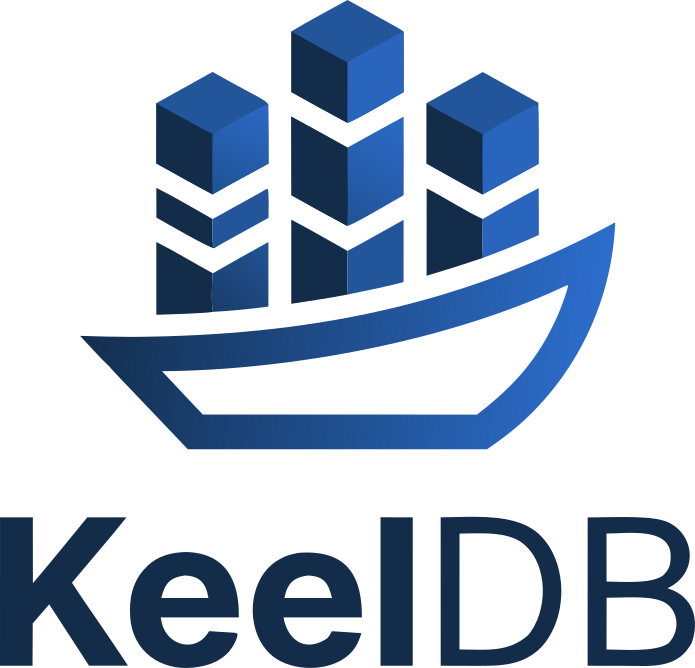
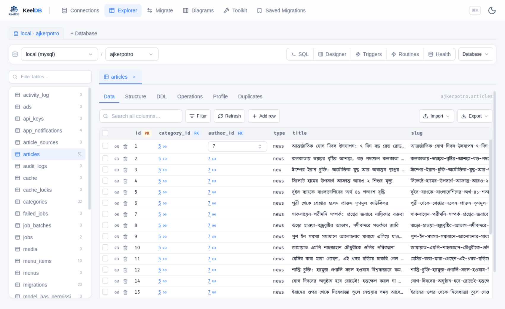
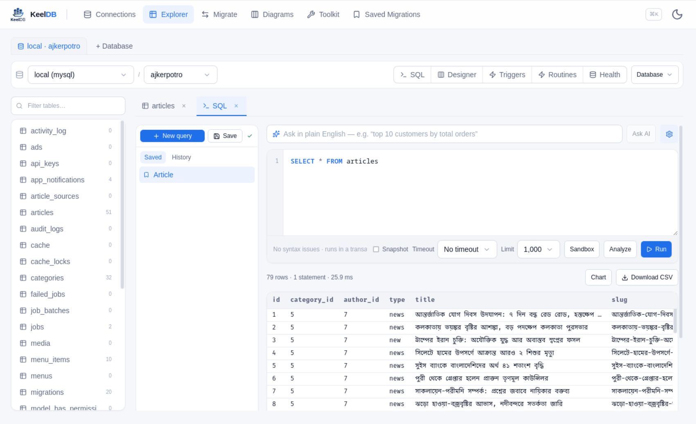
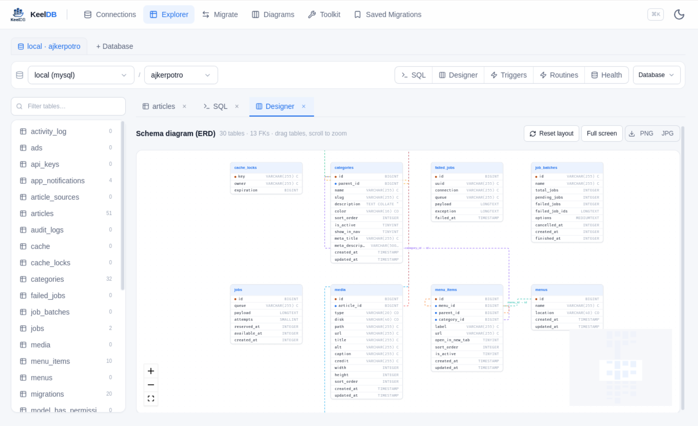
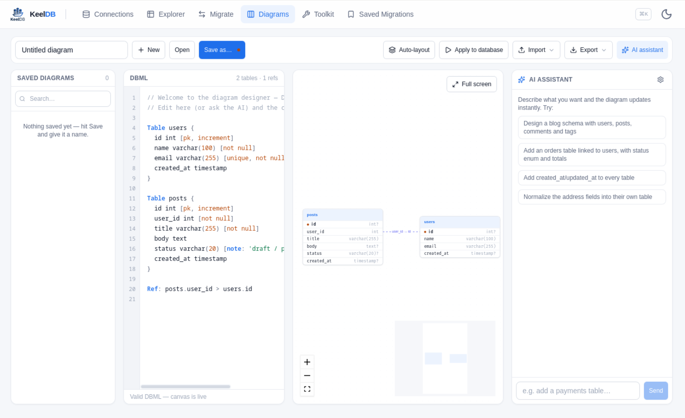

<div align="center">



# KeelDB

**A production-safe database workbench** — migrate, explore, guard, and monitor
**MySQL · PostgreSQL · Supabase · Neon** (or an imported `.sql` dump) from one clean app,
on the web and as a native desktop app.

[](https://github.com/md-golamrabbani/keeldb/actions/workflows/desktop.yml)
[](https://github.com/md-golamrabbani/keeldb/releases)
[](LICENSE)
[](https://github.com/md-golamrabbani/keeldb/releases)
[](CONTRIBUTING.md)

[**Download**](#-download) · [**Quick start**](#-run-from-source) · [**Features**](#-features) · [**Docs**](#-documentation) · [**Contributing**](CONTRIBUTING.md)

</div>

---

KeelDB is a GUI-driven database tool that does three jobs well:

1. **Migrate** data between MySQL / PostgreSQL / Supabase / Neon — or from a `.sql` dump — with a visual
   column-mapping canvas, safe per-column transforms, dry-runs, and batched, idempotent writes.
2. **Explore** any database like a lightweight SQL client: browse & filter rows, edit inline (Workbench-style
   staged saves), run SQL with autocomplete, and import/export tables.
3. **Design & guard** — an interactive ERD of your schema, structure editing, health checks, and safety rails
   that make writes to production deliberate rather than accidental.

It runs as a **web app** (FastAPI + Next.js) and ships as a **single-window native desktop app** for
Windows, macOS, and Linux (Tauri, with the Python backend bundled as a sidecar — no separate install).

## 📸 Screenshots

| Explorer | SQL editor |
| :---: | :---: |
|  |  |
| **ERD / Designer** | **Diagrams** |
|  |  |

## ⬇️ Download

Grab the installer for your OS from the [**Releases**](https://github.com/md-golamrabbani/keeldb/releases) page:

| OS | File |
| --- | --- |
| **Windows** | `.msi` or `.exe` (NSIS installer) |
| **macOS** (Apple Silicon & Intel) | `.dmg` |
| **Linux** | `.AppImage`, `.deb`, or `.rpm` |

The desktop app is fully self-contained — the database backend is bundled, so there's nothing else to install.

> Prefer the web app, or want the latest `main`? See [**Run from source**](#-run-from-source).

## ✨ Features

### Migrate
- **Any-to-any** across MySQL, PostgreSQL, Supabase, and Neon — or from an imported **`.sql` dump**
  (mysqldump / pg_dump), parsed into a local read-only SQLite source that keeps its **PKs and FKs**.
- **Visual column mapping** with **Auto-map** by normalized name, per-column **casts**
  (`int/numeric/bool/date/timestamp/uuid/text`), sandboxed **transform expressions**, defaults, and
  conflict keys. Type mismatches and unmapped NOT-NULL columns are flagged.
- **Preview & dry-run** every row before writing; **conflict strategies** (insert / upsert / skip-duplicates),
  batch size, WHERE filter, and stop-on-error.
- **Output your way** — push into the target DB, or download the transformed rows as `.sql`, `.csv`, or `.json`.
- **Reusable profiles** for connections and full mappings; **SSH-tunnel** support (bastion host).

### Explore
- **Tabbed table browser** — open many tables at once; tabs (and which schema they belong to) **persist across
  restarts**, Workbench-style.
- **Data grid** — rows-per-page, click-to-sort, all-column search, phpMyAdmin-style advanced filters, sticky
  header and left columns, FK peek-and-jump.
- **Workbench-style editing** — cell edits are **staged and highlighted**, then applied with **Save** or thrown
  away with **Revert** (no accidental auto-writes); all writes target rows by primary key.
- **SQL editor** — syntax highlighting, line gutter, **autocomplete** (keywords, tables, `table.column`),
  real-time error detection, a resizable pane, **run-the-selection**, and a row-limit cap. Runs in a
  transaction and rolls back on error.
- **Import / export** tables as CSV / JSON / SQL.

### Design & guard
- **Interactive ERD** — drag tables, zoom, full-screen, export as PNG/JPG, and view reconstructed
  `CREATE TABLE` DDL per table.
- **Structure editor** — add / rename / retype / drop columns (MySQL & Postgres).
- **Safety rails** — production connections require confirmation for writes; read-only mode blocks writes;
  large tables load instantly via catalog row estimates instead of full-table `COUNT(*)`.
- **AI assist (optional)** — natural-language → SQL using **Claude, ChatGPT, or Groq** with your own API key;
  the model only *suggests* a read-only SELECT, never executes anything.

### Toolkit
- 25+ built-in **SQL & data-prep utilities** (IN-clause builder, CSV→SQL, bulk insert/update, deduplicate,
  JWT inspector, hash/encoding, sample-data generator, and more) — all client-side.

## 🚀 Run from source

Two processes: a **FastAPI** backend on `:8000` and a **Next.js** frontend on `:3000`.

**Prerequisites:** Python 3.11+ and Node.js 20+.

### 1. Backend

```bash
cd backend
python3 -m venv .venv                     # first time only
.venv/bin/pip install -r requirements.txt
.venv/bin/uvicorn app.main:app --port 8000 --reload
```

API docs: <http://127.0.0.1:8000/docs>

> Port 8000 busy? Run on another port and point the frontend at it:
> `BACKEND_URL=http://127.0.0.1:8010 npm run dev`

### 2. Frontend

```bash
cd frontend
npm install                                # first time only
npm run dev
```

Open <http://localhost:3000>.

### Build the desktop app

See [docs/DESKTOP.md](docs/DESKTOP.md) and [docs/BUILDING.md](docs/BUILDING.md). In short, the backend is frozen
into a self-contained sidecar (PyInstaller) and bundled by Tauri; CI does this for all platforms on every
version tag (`v*`) via [`.github/workflows/desktop.yml`](.github/workflows/desktop.yml).

## 🧱 Tech stack

| Layer | Tech |
| --- | --- |
| Frontend | Next.js (App Router), React, TypeScript, Tailwind, Zustand |
| Desktop shell | Tauri (Rust) with the backend as a bundled sidecar |
| Backend | FastAPI, SQLAlchemy, Pydantic |
| Databases | MySQL (PyMySQL), PostgreSQL (psycopg), SQLite (imported dumps) |
| Security | Fernet-encrypted secrets at rest, SSH tunnels (paramiko), bcrypt |

## 📚 Documentation

- [Building & packaging](docs/BUILDING.md)
- [Desktop app notes](docs/DESKTOP.md)
- [Product plan / spec](docs/PLAN.md)
- [Roadmap](docs/ROADMAP.md)
- [Contributing guide](CONTRIBUTING.md)
- [Security policy](SECURITY.md)
- [Changelog](CHANGELOG.md)

## 🔒 Safety & privacy

- Introspection and previews are **read-only**; writes go only to the table you explicitly select.
- Every batch runs in a **transaction** — failed batches roll back and are logged.
- Deterministic `uuid5` keys + upsert make re-runs **converge** (a 1200-row re-run produced zero duplicates).
- Secrets (DB passwords, connection strings, SSH keys) are **Fernet-encrypted at rest** in `data/`
  (`data/key.bin`, mode `0600`), never returned by the API, never logged. `data/` is git-ignored — keep it so.
- Found a vulnerability? Please read [SECURITY.md](SECURITY.md) and report privately.

## 🤝 Contributing

Contributions, issues, and feature requests are welcome! Star ⭐ the repo, fork it, and open a PR.
Start with the [**Contributing guide**](CONTRIBUTING.md) and the [Code of Conduct](CODE_OF_CONDUCT.md).

## 📝 License

[MIT](LICENSE) © [Md. Golam Rabbani](https://github.com/md-golamrabbani)
